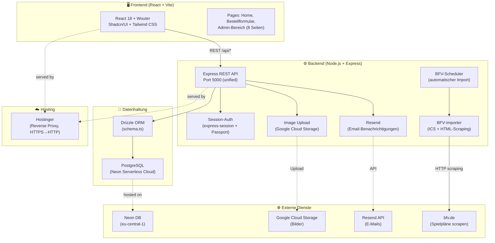

# Projektarchitektur: Vereins-Portal TSV Greding

> Automatisch generiert vom Project Architecture Skill.
> Kann committed werden — hat dokumentarischen Wert.

---

## 📊 Architektur-Diagramm



---

## 🔧 Stack-Übersicht

| Schicht | Technologie | Details |
|---|---|---|
| **Frontend** | React 18 + Vite | Wouter (Routing), TanStack Query, Framer Motion |
| **UI** | Shadcn/UI + Tailwind CSS | Radix UI Primitives, tw-animate-css |
| **Backend** | Node.js + Express | Monorepo, unified Server (FE + BE auf Port 5000) |
| **Datenbank** | PostgreSQL | Neon Serverless (eu-central-1), Drizzle ORM |
| **Auth** | express-session + Passport | Session-Cookie (Admin-Login), connect-pg-simple |
| **Hosting** | Hostinger | Reverse Proxy (HTTPS→HTTP intern), trust proxy=1 |
| **Email** | Resend | Bestellbestätigungen + Event-Anfrage-Benachrichtigungen |
| **Bilder** | Google Cloud Storage | Sharp für Bildverarbeitung, Uppy für Upload |
| **BFV-Import** | ICS + HTML-Scraping | Rate-limited (8s/req), automatischer Scheduler |

---

## 📁 Verzeichnisstruktur

```
vereins-portal/
├── client/                     # React Frontend (Vite)
│   ├── src/
│   │   ├── components/         # UI-Komponenten (shadcn + custom)
│   │   ├── pages/
│   │   │   ├── home.tsx        # Öffentliche Startseite
│   │   │   ├── order-form.tsx  # Sammelbestellungs-Formular
│   │   │   └── admin/          # Admin-Bereich (login, calendar, campaigns,
│   │   │                       #   orders, products, fields, requests,
│   │   │                       #   bfv-import, settings)
│   │   ├── hooks/              # Custom React Hooks
│   │   └── lib/                # Utilities
│   └── index.html
├── server/                     # Express Backend
│   ├── index.ts                # Entry Point + Middleware (Helmet, Sessions)
│   ├── routes.ts               # Alle API-Routen (~50 Endpoints)
│   ├── db.ts                   # Drizzle DB-Verbindung (Neon)
│   ├── dbStorage.ts            # Repository-Pattern für DB-Zugriffe
│   ├── bfvImporter.ts          # BFV Spielplan-Import (ICS + Scraping)
│   ├── bfvScheduler.ts         # Automatischer Import-Scheduler
│   ├── bfvImportService.ts     # Import-Business-Logic
│   ├── email.ts                # Resend E-Mail-Versand
│   ├── imageUpload.ts          # GCS-Bildupload + Sharp
│   ├── eventRequestService.ts  # Platz-Anfragen-Logik
│   └── dateTimeBerlin.ts       # Berlin-Timezone-Utilities
├── shared/
│   └── schema.ts               # Drizzle-Schema + Zod-Validierung (shared)
├── script/                     # Utility-Scripts (DB-Migration, Tests)
├── drizzle.config.ts           # Drizzle-Kit Konfiguration
└── vite.config.ts              # Vite + Express dev-server integration
```

---

## 🔌 Wichtigste API-Endpunkte

| Method | Route | Beschreibung |
|---|---|---|
| POST | `/api/auth/login` | Admin-Login (rate-limited) |
| GET | `/api/campaigns/active` | Aktive Sammelbestellungen (öffentlich) |
| POST | `/api/orders` | Bestellung aufgeben (öffentlich) |
| GET | `/api/public/calendar/fields` | Plätze + Ereignisse (öffentlich) |
| POST | `/api/public/event-requests` | Platz-Anfrage stellen (öffentlich) |
| GET | `/api/calendar/events` | Alle Kalender-Events (Admin) |
| POST | `/api/calendar/bfv-import/run` | BFV-Import manuell starten (Admin) |
| GET | `/api/orders/export/:campaignId` | Bestellungen als CSV-Export (Admin) |
| GET | `/api/admin/event-requests` | Platz-Anfragen verwalten (Admin) |
| POST | `/api/images/upload` | Bild hochladen (Admin) |

---

## 🌍 Umgebungsvariablen

```bash
DATABASE_URL=postgresql://...@neon.tech/neondb  # Neon Serverless DB
NODE_ENV=development|production
BFV_URL=https://www.bfv.de/vereine/...           # BFV-Vereinsseiten (kommagetrennt)
# RESEND_API_KEY, GCS-Credentials (nicht in .env.example)
```

---

## 📝 Architektur-Entscheidungen

- **Monorepo (client + server):** Ein Repo, ein Deploy — Vite wird in Production von Express geserved (`/dist`)
- **Drizzle ORM statt Prisma:** Leichtgewichtig, TypeScript-first, direkte SQL-Kontrolle
- **Neon Serverless PostgreSQL:** Skaliert auf 0 — ideal für Vereinsportal mit wenig Traffic
- **Session-Auth statt JWT:** Einfacher Admin-Bereich braucht kein Token-Refresh-Konzept
- **BFV-Scraping mit Ratelimit:** bfv.de hat keine offizielle API — ICS zuerst, HTML-Scraping als Fallback
- **Shared Schema:** `shared/schema.ts` wird von Frontend und Backend importiert — Typsicherheit end-to-end

---

## 🔗 Checkpoint-Referenz

Zuletzt aktualisiert: 2026-04-04
Checkpoint-Datei: `.claude-checkpoint.md`

---

*Generiert vom Project Architecture Skill • 2026-04-04*
